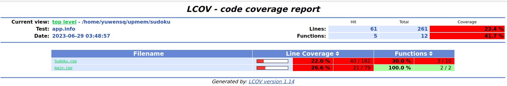
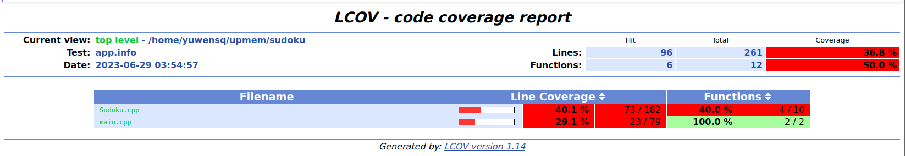
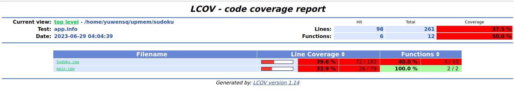
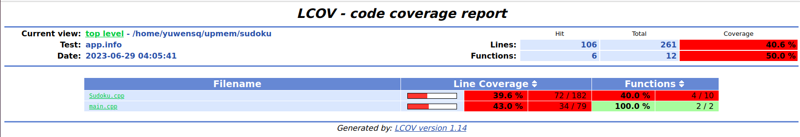
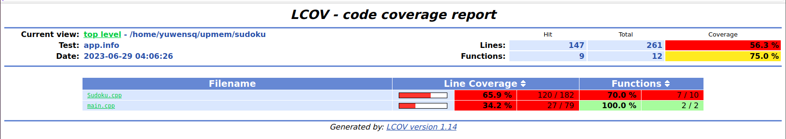
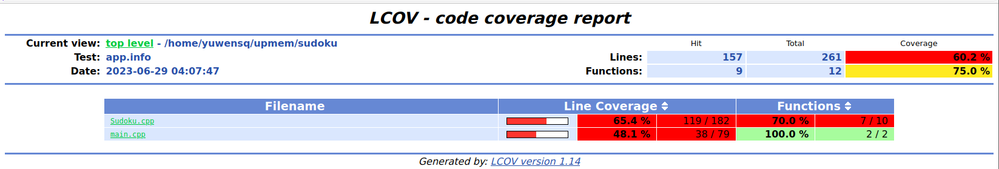
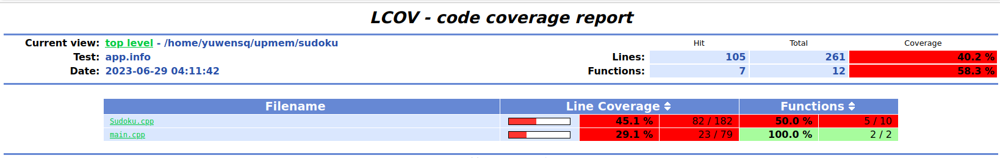

# 代码覆盖率

工具：gcov lcov

## 终局生成

执行命令：
```shell
./sudoku -c 10
```


## 游戏生成

执行命令：

```shell
./sudoku -n 1000
```



```
./sudoku -n 1000 -m 3
```



```shell
./sudoku -n 1000 -r 30~50
```



```shell
./sudoku -n 1000 -u
```



```shell
./sudoku -n 1000 -m 3 -r 20~55 -u
```



## 数独求解

执行命令：

```shell
./sudoku -s game.txt
```



覆盖率如上所示，所有测试样例相加几乎覆盖了所有的代码。