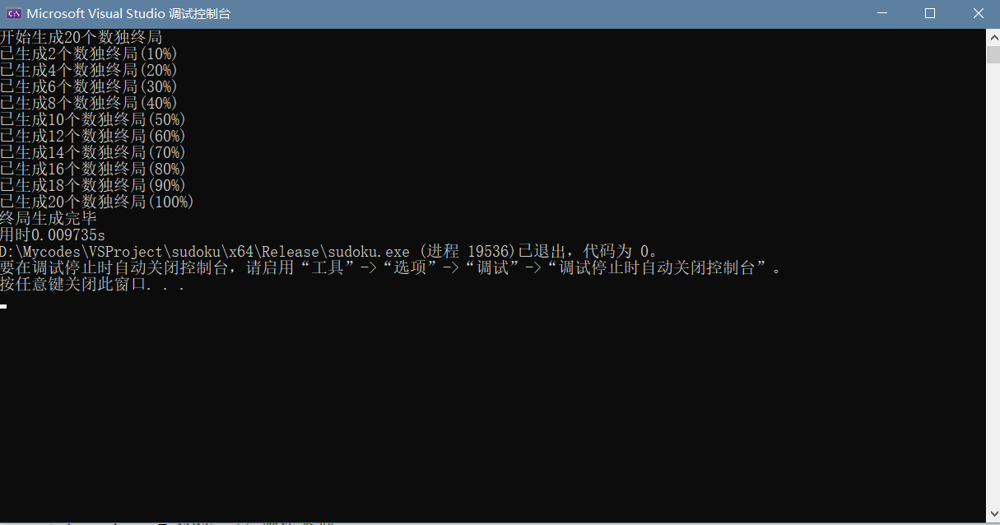
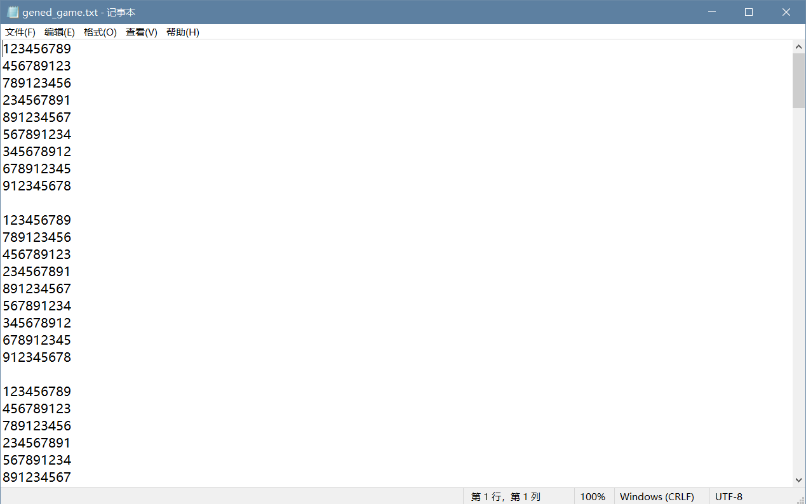
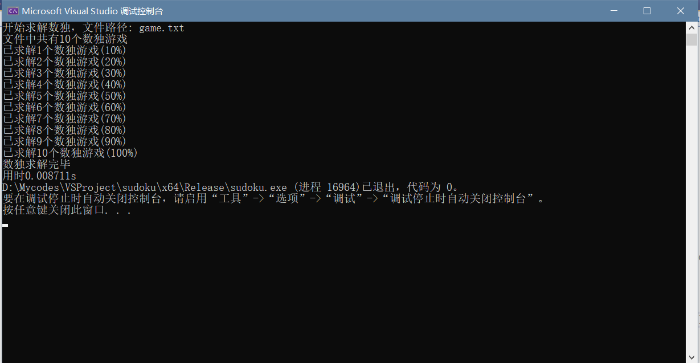
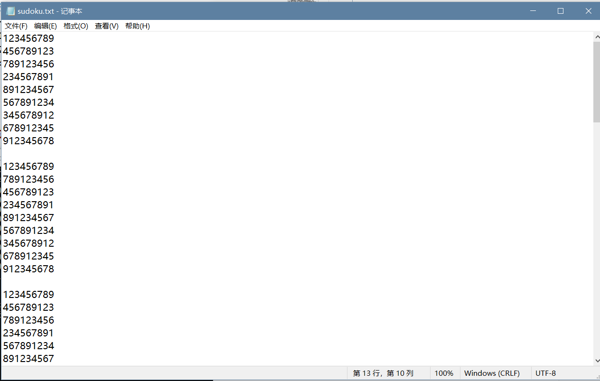
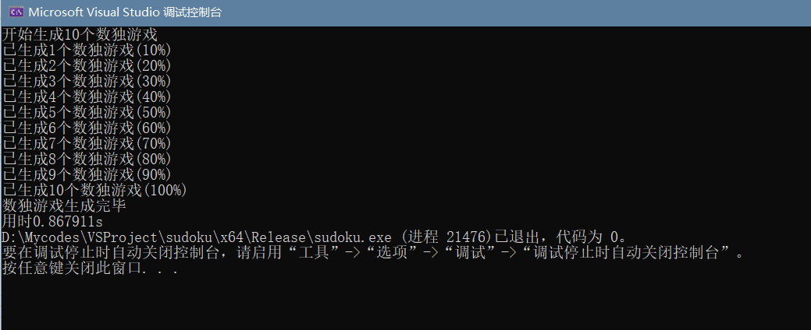
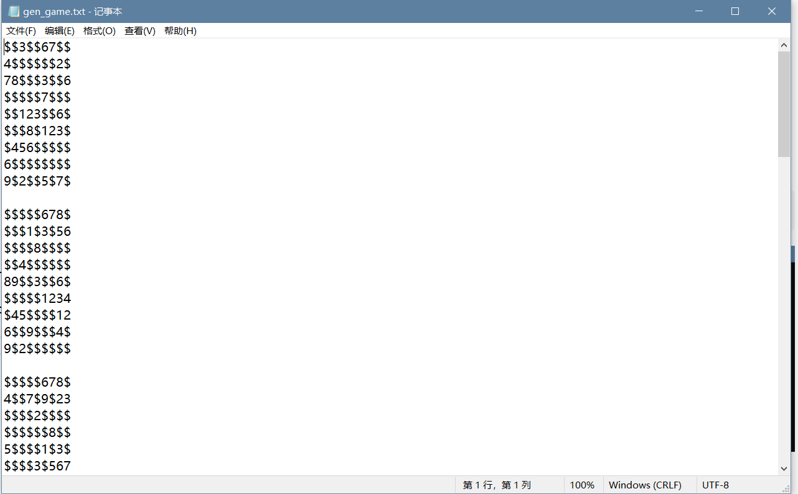

# 用户手册

| 参数 | 参数含义 | 范围限制 | 用法示例 |
| ---- | -------- | -------- | -------- |
| -c | 需要的数独终盘数量 | 1-1000000 | 示例: sudoku.exe -c 20 [ 表示生成20个数独终盘，生成至 "gened_game.txt" ]|
| -s | 需要解的数独棋盘文件路径 | 绝对或相对路径 | 示例: sudoku.exe -s game.txt  [ 表示从game.txt读取若干个数独游戏，并给出其解，生成到 "sudoku.txt" 中 ] |
| -n | 需要的游戏数量 | 1-10000 | 示例: sudoku.exe -n 1000 [ 表示生成1000个数独游戏，生成至 "gen_game.txt" ]|
| -m| 生成游戏的难度 | 1-3 |示例: sudoku.exe -n 1000 -m 1 [ 表示生成1000个简单数独游戏。只有-m、-n一起使用才认为参数无误，否则报错。对于难度评定的标准具体参见下一节叙述 ]|
| -r | 生成游戏中挖空的数量范围 | 20-55 | 示例: sudoku.exe -n 20 -r 20~55 [ 表示生成20个挖空数在20到55之间的数独游戏。只有-r、-n一起使用才认为参数无误，否则报错。若-m、-r一起使用，将按-r生成 |
| -u | 生成游戏的解难一 | | 示例: sudoku.exe -n 20 -u [ 表示生成20个解唯一的数独游戏。只有-u、-n一起使用才认为参数无误，否则报错。可以额外使用-m、-r指定挖空数。] |

## 难度评定
按照数独的空格数划分难度。

| 难度 | 空格数   |
| ---- | -------- |
| 1    | [11, 25] |
| 2    | [26, 40] |
| 3    | [41, 55] |

## 示例
### 终局生成
    sudoku.exe -c 20

输出20个数独终局至gened_game.txt中

### 游戏求解
    sudoku.exe -s game.txt

求解game.txt中的游戏，将终局输出至sudoku.txt中。

### 游戏生成
    sudoku.exe -n 10 -u -r 55~55 -m 1

输出10个唯一解的数独游戏至gen_game.txt中，按照-r指定挖空数为55。

