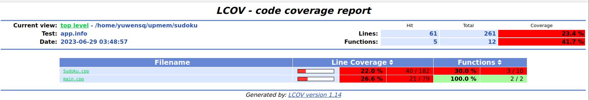
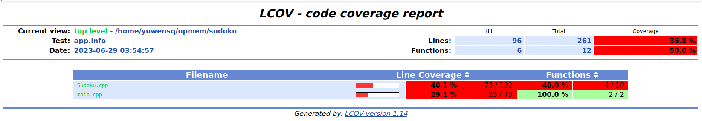
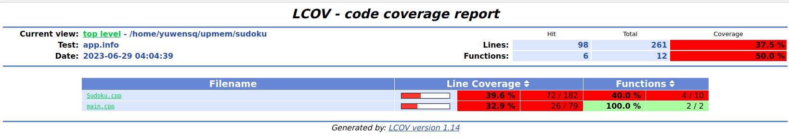
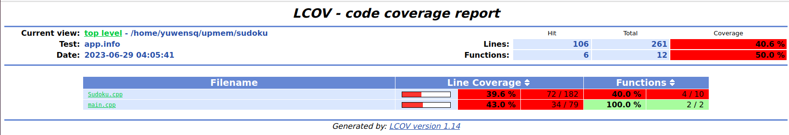
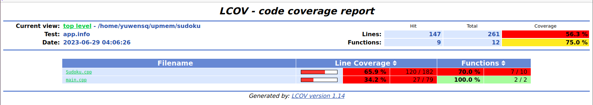
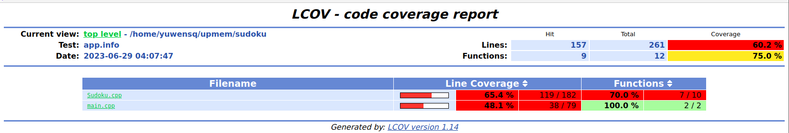
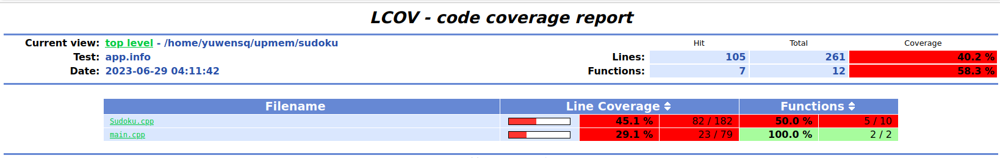
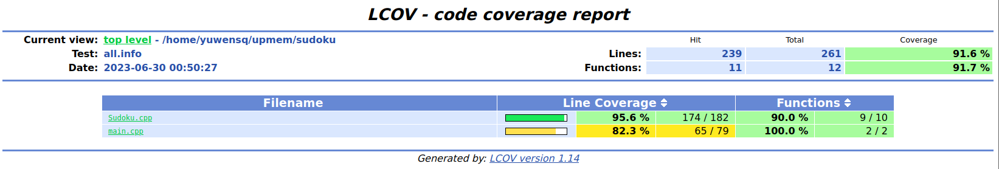

# 代码覆盖率

工具：gcov lcov

## 终局生成

执行命令：
```shell
./sudoku -c 10
```


## 游戏生成

执行命令：

```shell
./sudoku -n 1000
```



```
./sudoku -n 1000 -m 3
```



```shell
./sudoku -n 1000 -r 30~50
```



```shell
./sudoku -n 1000 -u
```



```shell
./sudoku -n 1000 -m 3 -r 20~55 -u
```



## 数独求解

执行命令：

```shell
./sudoku -s game.txt
```



## 错误测试

这一部分我们输入错误的指令，检测程序的错误处理能力，分别执行如下命令：

```shell
./sudoku -c -10
./sudoku -c 10000000
./sudoku -s not_exist_file.txt
./sudoku -n -10
./sudoku -n 100000
./sudoku -n 10 -m -1
./sudoku -n 10 -m 4
./sudoku -n -r 10~20
./sudoku -n -r 55~60
./sudoku -c 10 -u
./sudoku -c 10 -m 3
./sudoku -c 10 -r 20~25
./sudoku -c 10 -s game.txt
./sudoku -c 10 -n 10
```

由于检测到错误后程序将会报错并退出，代码覆盖率较低，这里省略具体覆盖率结果的展示。

## 总测试覆盖率

执行完所有上述的测试指令后，总的代码覆盖率如下图所示：

